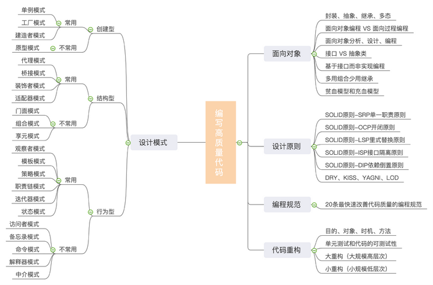

# 设计模式



> 设计模式干的事情无非就是多态

## 24大设计模式和7个原则

### 简单工厂模式

> 工厂模式的本质就是对获取对象过程的抽象

> 一个关注对象创建

工厂模式是创建型的设计模式，它接受指令，创建出符合要求的实例；它主要解决的是资源的统一分发，将对象的创建完全独立出来，让对象的创建和具体的使用客户无关。主要应用在多数据库选择，类库文件加载等

### 策略模式

> 一个关注行为的封装

在策略模式（Strategy Pattern）中，一个类的行为或其算法可以在运行时更改。这种类型的设计模式属于行为型模式。

在策略模式中，我们创建表示各种策略的对象和一个行为随着策略对象改变而改变的 context 对象。策略对象改变 context 对象的执行算法。

+ 意图：定义一系列的算法,把它们一个个封装起来, 并且使它们可相互替换。

+ 主要解决：在有多种算法相似的情况下，使用 if...else 所带来的复杂和难以维护。

+ 何时使用：一个系统有许多许多类，而区分它们的只是他们直接的行为。

+ 如何解决：将这些算法封装成一个一个的类，任意地替换。

+ 关键代码：实现同一个接口。

+ 应用实例： 1、诸葛亮的锦囊妙计，每一个锦囊就是一个策略。 2、旅行的出游方式，选择骑自行车、坐汽车，每一种旅行方式都是一个策略。 3、JAVA AWT 中的 LayoutManager。

+ 优点： 1、算法可以自由切换。 2、避免使用多重条件判断。 3、扩展性良好。

+ 缺点： 1、策略类会增多。 2、所有策略类都需要对外暴露。

+ 使用场景： 1、如果在一个系统里面有许多类，它们之间的区别仅在于它们的行为，那么使用策略模式可以动态地让一个对象在许多行为中选择一种行为。 2、一个系统需要动态地在几种算法中选择一种。 3、如果一个对象有很多的行为，如果不用恰当的模式，这些行为就只好使用多重的条件选择语句来实现。

+ 注意事项：如果一个系统的策略多于四个，就需要考虑使用混合模式，解决策略类膨胀的问题。


### 装饰器模式

装饰器模式（Decorator Pattern）允许向一个现有的对象添加新的功能，同时又不改变其结构。这种类型的设计模式属于结构型模式，它是作为现有的类的一个包装。

这种模式创建了一个装饰类，用来包装原有的类，并在保持类方法签名完整性的前提下，提供了额外的功能。

+ 意图：动态地给一个对象添加一些额外的职责。就增加功能来说，装饰器模式相比生成子类更为灵活。

+ 主要解决：一般的，我们为了扩展一个类经常使用继承方式实现，由于继承为类引入静态特征，并且随着扩展功能的增多，子类会很膨胀。

+ 何时使用：在不想增加很多子类的情况下扩展类。

+ 如何解决：将具体功能职责划分，同时继承装饰者模式。

+ 关键代码： 1、Component 类充当抽象角色，不应该具体实现。 2、修饰类引用和继承 Component 类，具体扩展类重写父类方法。

+ 应用实例： 1、孙悟空有 72 变，当他变成"庙宇"后，他的根本还是一只猴子，但是他又有了庙宇的功能。 2、不论一幅画有没有画框都可以挂在墙上，但是通常都是有画框的，并且实际上是画框被挂在墙上。在挂在墙上之前，画可以被蒙上玻璃，装到框子里；这时画、玻璃和画框形成了一个物体。

+ 优点：装饰类和被装饰类可以独立发展，不会相互耦合，装饰模式是继承的一个替代模式，装饰模式可以动态扩展一个实现类的功能。

+ 缺点：多层装饰比较复杂。

+ 使用场景： 1、扩展一个类的功能。 2、动态增加功能，动态撤销。

+ 注意事项：可代替继承。


### 行为型-状态模式

> 允许一个对象在其内部状态改变时改变它的行为。对象看起来似乎修改了它的类

状态模式（State）经常用在带有状态的对象中

什么是状态？我们以QQ聊天为例，一个用户的QQ有几种状态：

+ 离线状态（尚未登录）；
+ 正在登录状态；
+ 在线状态；
+ 忙状态（暂时离开）。

如何表示状态？我们定义一个enum就可以表示不同的状态。但不同的状态需要对应不同的行为，比如收到消息时：

```java
if (state == ONLINE) {
    // 闪烁图标
} else if (state == BUSY) {
    reply("现在忙，稍后回复");
} else if ...
```

状态模式的目的是为了把上述一大串if...else...的逻辑给分拆到不同的状态类中，使得将来增加状态比较容易。

### 7个原则

单一职责原则【SINGLE RESPONSIBILITY PRINCIPLE】: 一个类负责一项职责。

里氏替换原则【LISKOV SUBSTITUTION PRINCIPLE】: 继承与派生的规则。

依赖倒置原则【DEPENDENCE INVERSION PRINCIPLE】: 高层模块不应该依赖低层模块，二者都应该依赖其抽象；抽象不应该依赖细节；细节应该依赖抽象。即针对接口编程，不要针对实现编程。

接口隔离原则【INTERFACE SEGREGATION PRINCIPLE】: 建立单一接口，不要建立庞大臃肿的接口，尽量细化接口，接口中的方法尽量少。

迪米特法则【LOW OF DEMETER】: 低耦合，高内聚。

开闭原则【OPEN CLOSE PRINCIPLE】: 一个软件实体如类、模块和函数应该对扩展开放，对修改关闭。

组合/聚合复用原则【Composition/Aggregation Reuse Principle(CARP) 】: 尽量使用组合和聚合少使用继承的关系来达到复用的原则。
